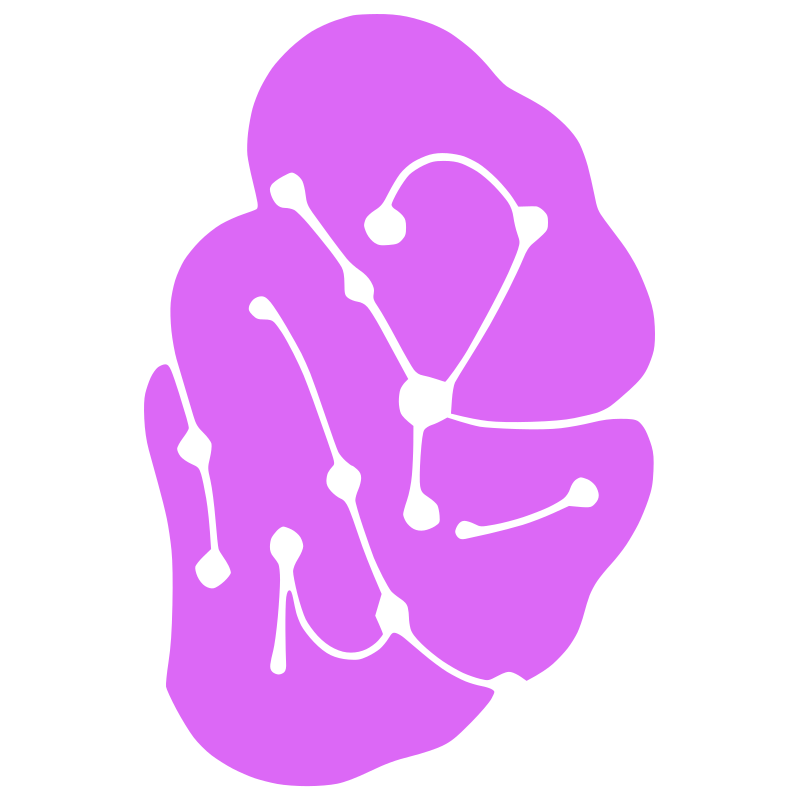
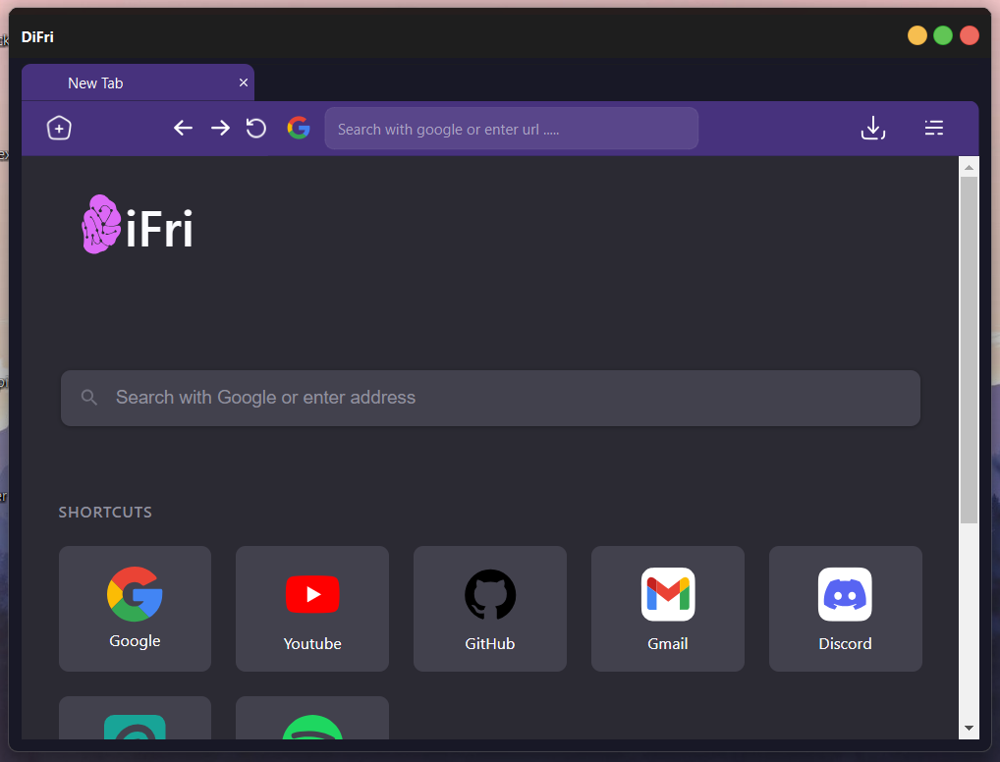
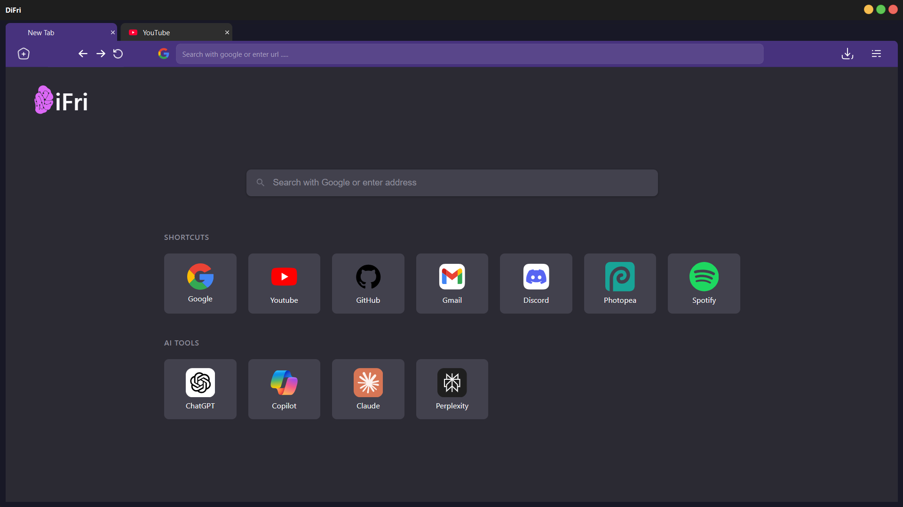
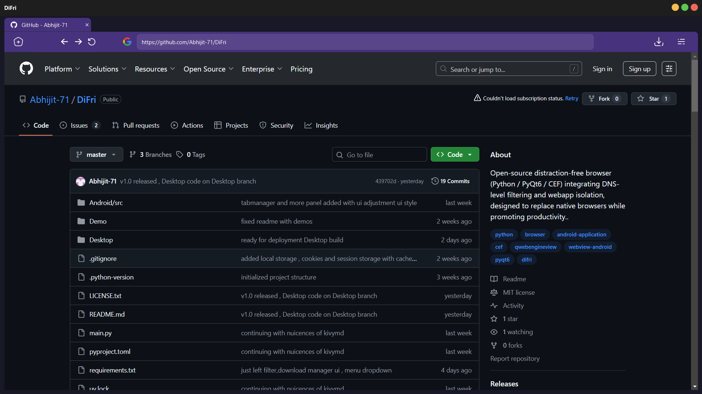

# DiFri Browser



A lightweight **Python browser** built with **PyQt6** and **QWebEngineView**, initialized using **`uv init`** for package management.
With a builtin in content filter , blocking certain domains and keywords a clean GUI.

---

## 🖥 Features

* Embedded **Chromium-based browser** using **QWebEngineView**
* Opens **DiFri HomePage** by default
* Navigation controls:

  * Back
  * Forward
  * Reload
* Address bar for custom URLs
* Download Manager
* Content filter , sfae for kids and schools
* Lightweight and cross-platform (Windows, macOS, Linux) if compiled properly.
* Easy to extend with additional PyQt6 widgets or custom styling

---

## Demo of Browser




===============================
* Demo of testing phase


## 🚀 Getting Started

1. Clone the repository:

```bash
git clone https://github.com/Abhijit-71/DiFri.git
cd DiFri
```

2. Initialize the environment and manage packages with **UV**:

```bash
uv install
```

3. Run the browser:

for windows --

```bash
cd Desktop
..\.venv\Scripts\activate.ps1
uv run main.py
```
---
## For Exclusive Platform Development
* Checkout Desktop and Andriod branches
* They just provide all req. and code for specific platform 
---

## 📝 Usage

* Enter a URL in the **address bar** and press **Enter** to navigate
* Use **Back**, **Forward**, and **Reload** buttons to control navigation
* The browser starts on **DiFri HomePage** by default

---

## ⚡ Notes

* **Python version:** Ensure compatibility with PyQt6 (usually Python 3.8–3.12, depending on PyQt6 release)
* You can extend the browser to:
* Current Features
  * Multiple tabs
  * Custom menus or toolbar actions
  * Download Manager
  * Cookie and network management

---

## 🔗 References

* [PyQt6 Documentation](https://www.riverbankcomputing.com/static/Docs/PyQt6/)
* [QWebEngineView Documentation](https://doc.qt.io/qt-6/qwebengineview.html)
* [UV Package Manager](https://uv.software/) (for managing dependencies and project environment)

---

## 🛠 License


