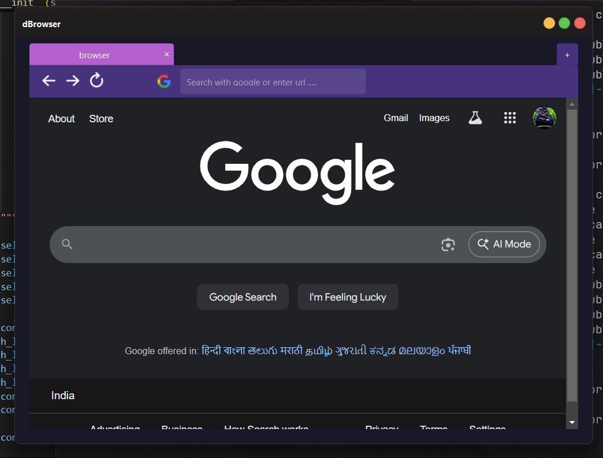
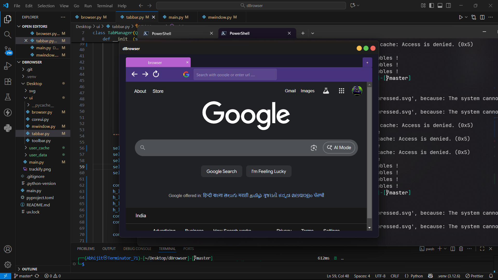
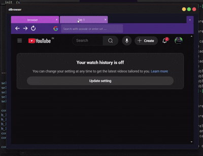

# dBrowser

A lightweight **Python browser** built with **PyQt6** and **QWebEngineView**, initialized using **`uv init`** for package management.
Opens **Google.com** by default and provides basic navigation controls in a clean GUI.

---

## 🖥 Features

* Embedded **Chromium-based browser** using **QWebEngineView**
* Opens **[https://www.google.com](https://www.google.com)** by default
* Navigation controls:

  * Back
  * Forward
  * Reload
* Address bar for custom URLs
* Lightweight and cross-platform (Windows, macOS, Linux)
* Easy to extend with additional PyQt6 widgets or custom styling

---

## Demo of Browser



===============================



## 🚀 Getting Started

1. Clone the repository:

```bash
git clone https://github.com/Abhijit-71/dBrowser.git
cd dBrowser
```

2. Initialize the environment and manage packages with **UV**:

```bash
uv install
```

3. Run the browser:

for windows --

```bash
cd Desktop
..\.venv\Scripts\activate.ps1
uv run main.py
```

---

## 📝 Usage

* Enter a URL in the **address bar** and press **Enter** to navigate
* Use **Back**, **Forward**, and **Reload** buttons to control navigation
* The browser starts on **Google.com** by default

---

## ⚡ Notes

* **Python version:** Ensure compatibility with PyQt6 (usually Python 3.8–3.12, depending on PyQt6 release)
* You can extend the browser to:

  * Multiple tabs
  * Custom menus or toolbar actions
  * JavaScript / Python communication via QWebChannel
  * Cookie and network management

---

## 🔗 References

* [PyQt6 Documentation](https://www.riverbankcomputing.com/static/Docs/PyQt6/)
* [QWebEngineView Documentation](https://doc.qt.io/qt-6/qwebengineview.html)
* [UV Package Manager](https://uv.software/) (for managing dependencies and project environment)

---

## 🛠 License


